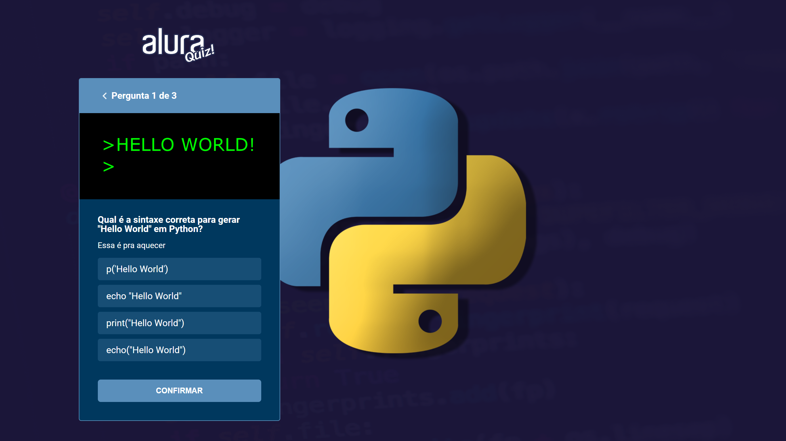

[contributors-shield]: https://img.shields.io/github/contributors/luanws/quiz.svg?style=for-the-badge
[contributors-url]: https://github.com/luanws/quiz/graphs/contributors
[forks-shield]: https://img.shields.io/github/forks/luanws/quiz.svg?style=for-the-badge
[forks-url]: https://github.com/luanws/quiz/network/members
[stars-shield]: https://img.shields.io/github/stars/luanws/quiz.svg?style=for-the-badge
[stars-url]: https://github.com/luanws/quiz/stargazers
[issues-shield]: https://img.shields.io/github/issues/luanws/quiz.svg?style=for-the-badge
[issues-url]: https://github.com/luanws/quiz/issues
[license-shield]: https://img.shields.io/github/license/luanws/quiz.svg?style=for-the-badge
[license-url]: https://github.com/luanws/quiz/blob/master/LICENSE.txt
[linkedin-shield]: https://img.shields.io/badge/-LinkedIn-black.svg?style=for-the-badge&logo=linkedin&colorB=555
[linkedin-url]: https://www.linkedin.com/in/luanws/

[![Contributors][contributors-shield]][contributors-url]
[![Forks][forks-shield]][forks-url]
[![Stargazers][stars-shield]][stars-url]
[![Issues][issues-shield]][issues-url]
[![License][license-shield]][license-url]
[![LinkedIn][linkedin-shield]][linkedin-url]

 
 

    

  

    <a href="https://quiz-imersao-react-alura.vercel.app/">Acessar aplicação WEB</a>
    ·
    <a href="https://github.com/luanws/quiz/issues">Reportar Bug</a>
    ·
    <a href="https://github.com/luanws/quiz/issues">Sugerir funcionalidade</a>
  

 

# 🔖 Sobre

    Este quiz foi desenvolvido durante a imersão React da Alura.

# 🚀 Tecnologias utilizadas

- [Next.js](https://nextjs.org/)
- [React.js](https://reactjs.org/)
- [Typescript](https://www.typescriptlang.org/)